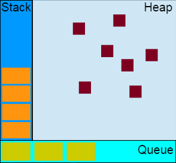

## css
### 水平垂直居中
* flex
* [子元素有宽高]父元素绝对定位，子元素相对定位，子元素`left: 0;right: 0;top: 0;bottom: 0;margin: auto; `
* [子元素没宽高]父元素绝对定位，子元素相对定位，子元素`top:50%;left:50%;transform: translate(-50%, -50%);`

### 三栏布局

### rem、em、px
* rem html的字体大小
* em 父元素的字体大小
* px 物理像素
* dpr 设备像素比

### rem自适应
```js
// 基准大小
const baseSize = 32
// 设置 rem 函数
function setRem() {
  // 当前页面宽度相对于 750 宽的缩放比例，可根据自己需要修改。
  const scale = document.documentElement.clientWidth / 750
  // 设置页面根节点字体大小
  document.documentElement.style.fontSize = (baseSize * Math.min(scale, 2)) + 'px'
}
// 初始化
setRem()
// 改变窗口大小时重新设置 rem
window.onresize = function () {
  setRem()
}
```
### 媒体查询
@media
### 盒模型
* content + padding + border

### BFC
* 块级格式化上下文
* 一个块格式化上下文由以下之一创建：
 * 根元素或其它包含它的元素
 * 浮动元素 (元素的 float 不是 none)
 * 绝对定位元素 (元素具有 position 为 absolute 或 fixed)
 * 内联块 (元素具有 display: inline-block)
 * 表格单元格 (元素具有 display: table-cell，HTML表格单元格默认属性)
 * 表格标题 (元素具有 display: table-caption, HTML表格标题默认属性)
 * 具有overflow 且值不是 visible 的块元素，
 * display: flow-root
 * column-span: all 应当总是会创建一个新的格式化上下文，即便具有 column-span: all 的元素并不被包裹在一个多列容器中。
 * 一个块格式化上下文包括创建它的元素内部所有内容，除了被包含于创建新的块级格式化上下文的后代元素内的元素。
 * 块格式化上下文对于定位 (参见 float) 与清除浮动 (参见 clear) 很重要。定位和清除浮动的样式规则只适用于处于同一块格式化上下文内的元素。浮动不会影响其它块格式化上下文中元素的布局，并且清除浮动只能清除同一块格式化上下文中在它前面的元素的浮动。

 * 浏览器对于BFC这块区域的约束规则如下：
  1. 内部的Box会在垂直方向上一个接一个的放置
  2. 垂直方向上的距离由margin决定。（完整的说法是：属于同一个BFC的两个相邻Box的margin会发生重叠，与方向无关。）
  3. 每个元素的左外边距与包含块的左边界相接触（从左向右），即使浮动元素也是如此。（这说明BFC中子元素不会超出他的包含块，而position为absolute的元素可以超出他的包含块边界）
  4. BFC的区域不会与float的元素区域重叠
  5. 计算BFC的高度时，浮动子元素也参与计算
  6. BFC就是页面上的一个隔离的独立容器，容器里面的子元素不会影响到外面元素，反之亦然

* 清除浮动
```css
.clearfix:after {
  content: "";
  display: block;
  clear: both;
}
```
### animation

## js

### 数组方法
* map
* forEach
* filter
* reduce
* push
* pop
* shift
* unshift
* splice
* sort
* join
* find
* findIndex
* every
* some
* from
* flat(Infinity)

### 类数组转换
* Array.from(arr)
* Array.prototype.slice.call(arr)
### 箭头函数this指向
* 定义时的对象
### let const var 区别
#### var
* 全局变量
* 变量提升
* 允许只定义不赋值
* 允许重复声明
* 允许只定义不赋值

#### let
* 声明变量
* 块级作用域
* 不会变量提升
* 暂时性死区
* 不允许重复声明
* 允许只定义不赋值

#### const
* 声明常量
* 对于基本数据类型 声明后不可修改；复杂数据类型可以修改 禁止这么做
* 块级作用域
* 不会变量提升
* 不允许重复声明
* 不允许只定义不赋值

### Promise
* 异步编程的一种解决方案
```js
const promise = new Promise(function(resolve, reject) {
  // ... some code

  if (/* 异步操作成功 */){
    resolve(value);
  } else {
    reject(error);
  }
});
```
* 三种状态
  1. pending => fulfilled
  2. pending => rejected
* 特点：状态不可逆
* 方法：
  1. Promise.prototype.then
  2. Promise.prototype.catch
  3. Promise.prototype.finally()
  4. Promise.all([])
  5. Promise.race([])
  6. Promise.any()
  7. Promise.resolve() 
  8. Promise.reject()
### async await

### 闭包
* 函数嵌套函数
* 外面的函数能访问里面函数的变量
* 特点：
  1. 常驻内存
  2. 容易引起内存泄漏

### 继承
```js
// 1.原型链继承
function Person() {
  this.name = 'xiaopao';
}

Person.prototype.getName = function() {
  console.log(this.name);
}

function Child() {}

Child.prototype = new Person();
var child1 = new Child();
child1.getName(); // xiaopao

// 2.借用构造函数（经典继承）
function Person() {
  this.name = 'xiaopao';
  this.colors = ['red', 'blue', 'green'];
}

Person.prototype.getName = function() {
  console.log(this.name);
}

function Child() {
  Person.call(this);
}

var child1 = new Child();
var child2 = new Child();
child1.colors.push('yellow');
console.log(child1.name);
console.log(child1.colors); // ["red", "blue", "green", "yellow"]
console.log(child2.colors); // ["red", "blue", "green"]
// 3.组合继承
function Parent(name) {
  this.name = name;
  this.colors = ['red', 'blue', 'green'];
}

Parent.prototype.getName = function() {
  console.log(this.name);
}

function Child(name, age) {
  Parent.call(this, name);// 第二次调用 Parent()
  this.age = age;
}

Child.prototype = new Parent(); // 第一次调用 Parent()

var child1 = new Child('xiaopao', 18);
var child2 = new Child('lulu', 19);
child1.getName(); // xiaopao
child2.getName(); // lulu
console.log(child1.age); // 18
console.log(child2.age); // 19
child1.colors.push('yellow');
console.log(child1.colors);  // ["red", "blue", "green", "yellow"]
console.log(child2.colors); // ["red", "blue", "green"]
console.log(child1 instanceof Child); // true
console.log(child1 instanceof Parent); // true
// 4.原型链继承

```
### __proto__、prototype
* js中每个对象都有__proto__
* prototype只有构造函数才有

### instanceof (检测构造函数的 prototype 属性是否出现在某个实例对象的原型链)
```js
  let a = {}
  a.__proto__ === Object.prototype //true
  a instanceof Object //true
```

### typeof
```js
  typeof null //object
  typeof undefined //undefined
  typeof NaN //number
```

### 事件机制
* 事件捕获
* 目标
* 事件冒泡 （阻止事件冒泡 `e.stopPropagation `）
* target(事件的真正发出者，即触发事件的节点)、currentTarget(始终是监听事件者)
* 事件委托

### 栈、堆
* 栈：栈内存主要用于存储各种基本类型的变量，以及指针
* 堆：复杂数据类型

### 深拷贝、浅拷贝

## 浏览器

### 状态码
* 301 被请求的资源已永久移动到新位置
* 302 请求的资源临时从不同的 URI响应请求。
* 303 对应当前请求的响应可以在另一个 URL 上被找到，而且客户端应当采用 GET 的方式访问那个资源
* 304 如果客户端发送了一个带条件的 GET 请求且该请求已被允许，而文档的内容（自上次访问以来或者根据请求的条件）并没有改变，则服务器应当返回这个状态码
* 305 被请求的资源必须通过指定的代理才能被访问
* 400 语义有误，当前请求无法被服务器理解、请求参数有误。
* 401 当前请求需要用户验证
* 403 服务器已经理解请求，但是拒绝执行它。
* 500 服务器遇到了一个未曾预料的状况，导致了它无法完成对请求的处理。
* 501 当服务器无法识别请求的方法，并且无法支持其对任何资源的请求。
* 502 作为网关或者代理工作的服务器尝试执行请求时，从上游服务器接收到无效的响应
* 503 由于临时的服务器维护或者过载，服务器当前无法处理请求

### 缓存
### cookie localStorage sessionStorage

### cookie session
* cookie 存储于浏览器，存储量小，只能存储字符串，不安全
* session 存储于服务器，占用服务器资源，支持各种类型对象，安全

### event loop

* 堆（先进后出）

* 队列(先进先出)


* 宏任务（setTimeout/setInterval）
* 微任务（Promise/process.nextTick）


### 回流重绘
1. 回流(Reflow)
  * 当Render Tree中部分或全部元素的尺寸、结构、或某些属性发生改变时，浏览器重新渲染部分或全部文档的过程称为回流。

2. 重绘(Repaint)
  * 当页面中元素样式的改变并不影响它在文档流中的位置时（例如：color、background-color、visibility等），浏览器会将新样式赋予给元素并重新绘制它，这个过程称为重绘。

3. 性能影响：回流比重绘的代价要更高。回流必将引起重绘，重绘不一定会引起回流。

### 浏览器渲染机制
> 浏览器使用流式布局模型 (Flow Based Layout)。
> 浏览器会把HTML解析成DOM，把CSS解析成CSSOM，DOM和CSSOM合并就产生了Render Tree。
> 有了RenderTree，我们就知道了所有节点的样式，然后计算他们在页面上的大小和位置，最后把节点绘制到页面上。


### 同步异步
1. js单线程，只能一个处理完成，再去处理另一个。
2. 为了优化用户体验，需要加载时间的内容，例如图片、媒体文件等可以进行异步加载。


### 跨域
1. 服务器代理
  * Access-Control-Allow-Origin: *
2. jsonp

## vue

### 双向绑定原理
* ‘数据劫持’ + 订阅发布模式实现
* Object.defineProperty 与 proxy 的区别
### v-model实现

### 父子组件传值
* props
* this.$emit
* Children
### computed、watch区别
1. watch擅长处理的场景：一个数据影响多个数据
2. computed擅长处理的场景：一个数据受多个数据影响

### 生命周期
* init
* beforeCreate 在实例初始化之后，数据观测 (data observer) 和 event/watcher 事件配置之前被调用
* created 数据观测 (data observer)，属性和方法的运算，watch/event 事件回调。然而，挂载阶段还没开始，$el 属性目前不可见。
* beforeMount 在挂载开始之前被调用：相关的 render 函数首次被调用 该钩子在服务器端渲染期间不被调用
* mounted el 被新创建的 vm.$el 替换，并挂载到实例上去之后调用该钩子。如果 root 实例挂载了一个文档内元素，当 mounted 被调用时 vm.$el 也在文档内。该钩子在服务器端渲染期间不被调用
* beforeUpdate 数据更新时调用，发生在虚拟 DOM 打补丁之前。这里适合在更新之前访问现有的 DOM，比如手动移除已添加的事件监听器 该钩子在服务器端渲染期间不被调用，因为只有初次渲染会在服务端进行。
* updated 由于数据更改导致的虚拟 DOM 重新渲染和打补丁，在这之后会调用该钩子。该钩子在服务器端渲染期间不被调用。
* beforeDistory 实例销毁之前调用。在这一步，实例仍然完全可用。该钩子在服务器端渲染期间不被调用。
* distoryed Vue 实例销毁后调用。调用后，Vue 实例指示的所有东西都会解绑定，所有的事件监听器会被移除，所有的子实例也会被销毁。 该钩子在服务器端渲染期间不被调用。

### 
```js
// 注册一个全局自定义指令 `v-focus`
Vue.directive('focus', {
  // 当被绑定的元素插入到 DOM 中时……
  inserted: function (el) {
    // 聚焦元素
    el.focus()
  }
})
// 局部指令
directives: {
  focus: {
    // 指令的定义
    inserted: function (el) {
      el.focus()
    }
  }
}
```
```html
<!-- 使用 -->
<input v-focus/>
```
* 钩子函数
  1. bind：只调用一次，指令第一次绑定到元素时调用。在这里可以进行一次性的初始化设置。
  2. inserted：被绑定元素插入父节点时调用 (仅保证父节点存在，但不一定已被插入文档中)。
  3. update：所在组件的 VNode 更新时调用，但是可能发生在其子 VNode 更新之前。指令的值可能发生了改变，也可能没有。但是你可以通过比较更新前后的值来忽略不必要的模板更新
  4. componentUpdated：指令所在组件的 VNode 及其子 VNode 全部更新后调用。
  5. unbind：只调用一次，指令与元素解绑时调用。
* 钩子函数的参数
  1. el：指令所绑定的元素，可以用来直接操作dom
  2. binding：一个对象，包含以下属性
    * name：指令名，不包括前缀
    * value：指令绑定值，例如：v-my-directive="1 + 1" 中，绑定值为 2。
    * oldValue：指令绑定的前一个值，仅在 update 和 componentUpdated 钩子中可用。无论值是否改变都可用。
    * expression：字符串形式的指令表达式。例如 v-my-directive="1 + 1" 中，表达式为 "1 + 1"。
    * arg：传给指令的参数，可选。例如 v-my-directive:foo 中，参数为 "foo"
    * modifiers：一个包含修饰符的对象。例如：v-my-directive.foo.bar 中，修饰符对象为 { foo: true, bar: true }
  3. vnode：Vue 编译生成的虚拟节点
  4. oldVnode：上一个虚拟节点，仅在 update 和 componentUpdated 钩子中可用。
   ```html
   <div id="hook-arguments-example" v-demo:foo.a.b="message"></div>
   ```
   ```js
    Vue.directive('demo', {
      bind: function (el, binding, vnode) {
        var s = JSON.stringify
        el.innerHTML =
          'name: '       + s(binding.name) + '<br>' +
          'value: '      + s(binding.value) + '<br>' +
          'expression: ' + s(binding.expression) + '<br>' +
          'argument: '   + s(binding.arg) + '<br>' +
          'modifiers: '  + s(binding.modifiers) + '<br>' +
          'vnode keys: ' + Object.keys(vnode).join(', ')
      }
    })

    new Vue({
      el: '#hook-arguments-example',
      data: {
        message: 'hello!'
      }
    })
    /*
    * name: "demo"
    * value: "hello!"
    * expression: "message"
    * argument: "foo"
    * modifiers: {"a":true,"b":true}
    * vnode keys: tag, data, children, text, elm, ns, context, fnContext, fnOptions, fnScopeId, key, componentOptions,     * componentInstance, parent, raw, isStatic, isRootInsert, isComment, isCloned, isOnce, asyncFactory, asyncMeta, isAsyncPlaceholder
    */
    ```
* 动态指令参数
  在 `v-mydirective:[argument]="value"` 中，`argument` 参数可以根据组件实例数据进行更新


### keep-alive
* 钩子函数
  1. activated：keep-alive 组件激活时调用
  2. deactivated：keep-alive 组件停用时调用

### Vue.nextTick( [callback, context] )
* 在下次 DOM 更新循环结束之后执行延迟回调。在修改数据之后立即使用这个方法，获取更新后的 DOM
> 参数：{Function} [callback]， {Object} [context]

### key值的作用

## vue-router

### $router、$route的区别
* router 全局路由
* 当前路由 path、parmas、query、fullPath、、
  1. parmas /user/:id => /user/34  [name] 不传刷新会消失
  2. query /user/ => /user/id=34 [path] 

### 导航守卫
1. 全局前置守卫
2. 全局解析守卫
3. 全局后置守卫
4. 路由独享的守卫
5. 组件内的守卫

### 路由懒加载
`()=>{import('@src/pages/Home')}`
### 滚动行为（scrollBehavior）

### params、query

### 编程式导航
* router.push(location, onComplete?, onAbort?)
```js
// 字符串
router.push('home')

// 对象
router.push({ path: 'home' })

// 命名的路由
router.push({ name: 'user', params: { userId: '123' }})

// 带查询参数，变成 /register?plan=private
router.push({ path: 'register', query: { plan: 'private' }})
```
* router.replace(location, onComplete?, onAbort?)

* router.go(n)

## vuex

### 原理


### 核心概念
1. state
  * 单一状态树
2. getter
  * 数据的简单处理，多用于展示
3. action
  * 通过`store.dispatch()`来分发action  提交的是mutation 异步 
4. mutation
  * 更新state的唯一方式 同步 
6. module

## webpack
